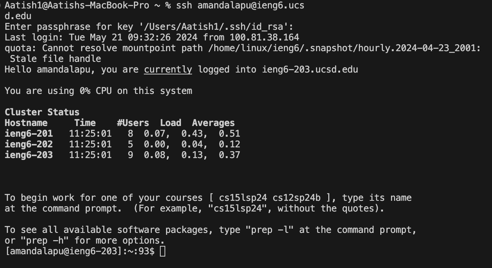
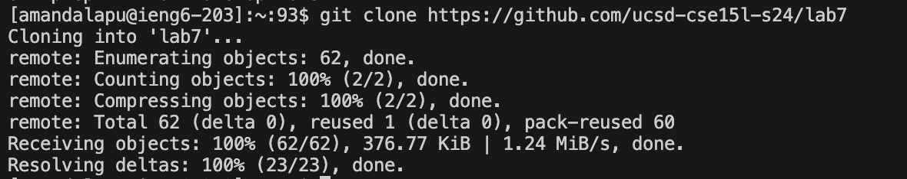
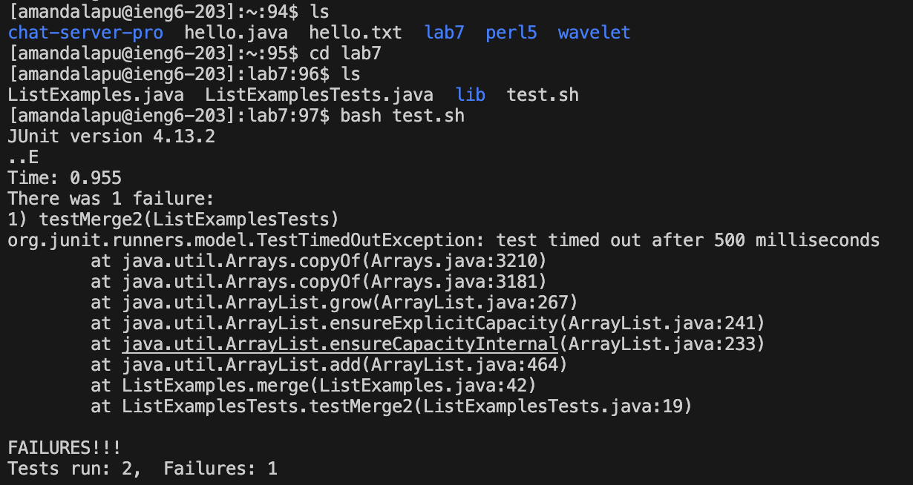
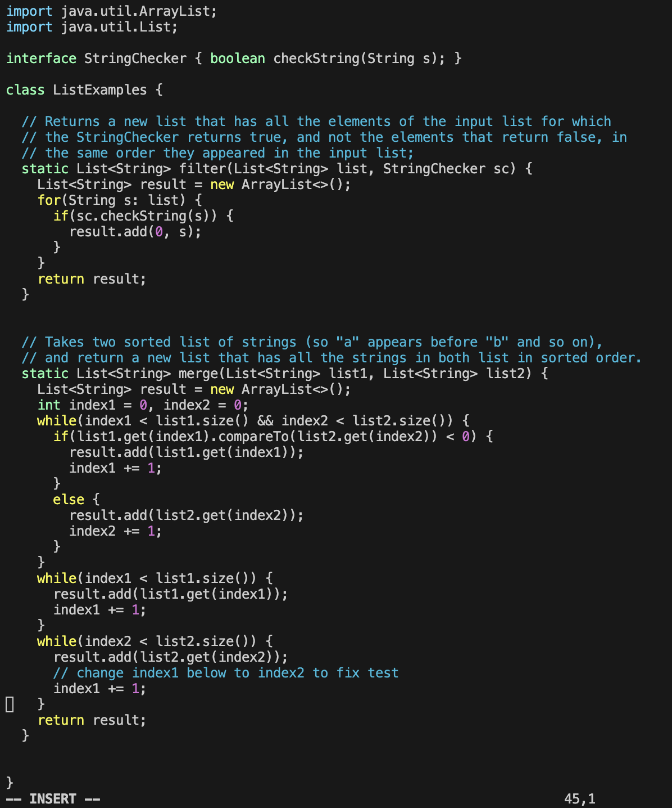
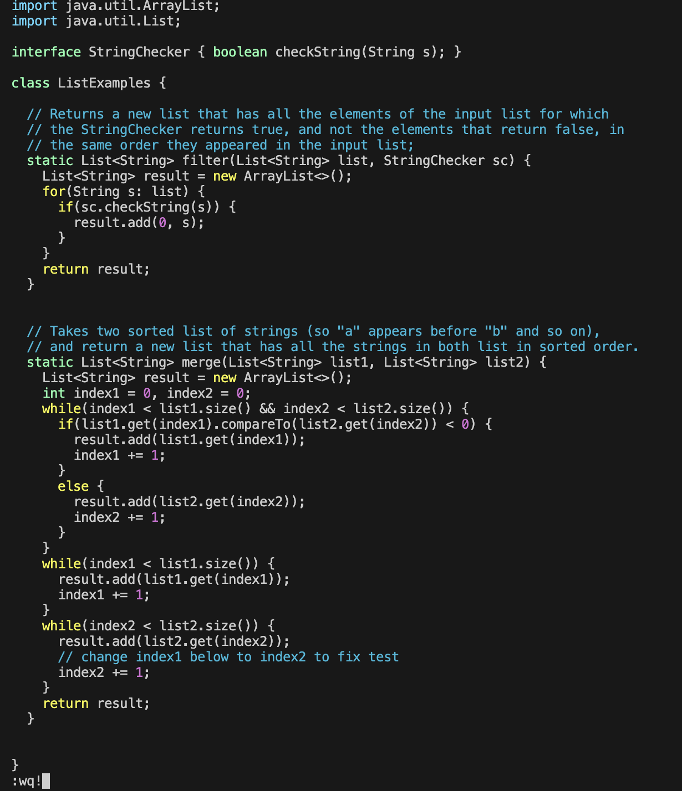
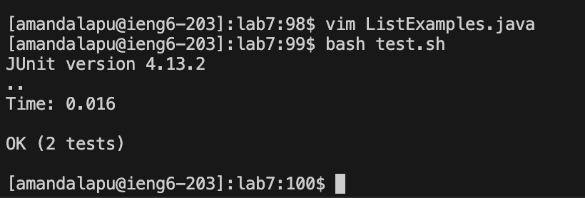
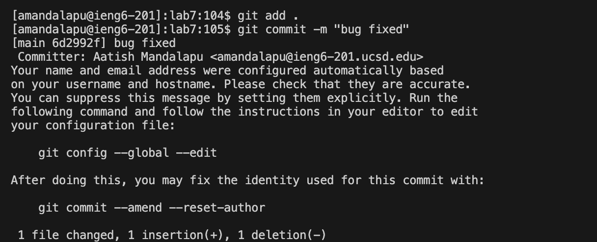
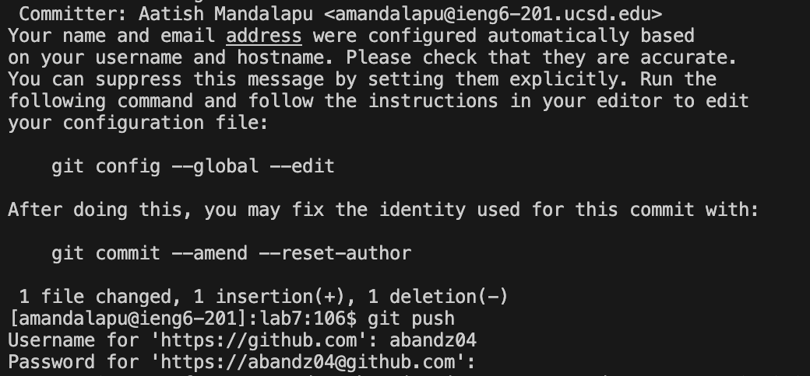

# Lab Report 4
## Aatish Mandalapu - A17350430
---
## Step 4
- Logging into ieng6 server
- To do this, I used the command `ssh amandalapu@ieng6.ucsd.edu`.

- This command logged me in through
## Step 5
- I used the `git clone` command to copy my lab7 github fork into the server terminal.
- To use the shortcuts mentioned in the lab, after I typed git clone, I used `<cmd C>` and `<cmd V>` to copy and paste the lab fork URL into terminal.

## Step 6
- To run the test and show that it fails, I used the `ls` command to show me the content of files in the ieng6 server.
- Next I moved to the `lab7` directory with the command `cd l <tab>` then `<enter>` which autocompleted the lab7 input and placed me in the correct directory.
- To run `test.sh`, I used `ls` within the `lab7` directory to find the test file. After seeing that it was in the directory, I did `bash t` and `<tab>` to automatically input `test.sh` into the command line following the `bash command`.

- These commands allowed us to find the necessary files to run JUnit tests. These tests output 1 failure.
## Step 7
- To fix the failure in the `ListExamples.java` file, I used `vim ListExamples.java` then `<enter>` without the usual `tab` to autocomplete the name since there was another file with a similar name.
- Once inside vim, I went into insert mode by clicking `<i>`.
- After going into insert mode, I went down 43 lines and right 12 spaces using the arrow keys to edit the error in the code. Then once I reached `index1`, I clicked `<backspace>` to delete the 1, and replaced it with "2" to make it into `index2`. 
- After fixing the bug, I exited insert mode with the `<esc>` button then used the command `:wq!` to save and exit the file automatically with the `!`.
- Before debug in vim

- After debug in vim

Keys pressed instead of arrows: `<k><k><k><k><k><k><l><l><l><l><l><l><l><l><x><i><2><esc><:w><q><!><enter>` 
## Step 8
- To run the tests and show that there is no failure in the output, I had to exit vim using the command mentioned above, `:wq!`.
- Then to test the file, I used the up arrow key twice (2x) to retrieve the previous `bash test.sh` command and clicked `<enter>` to test the file. 

## Step 9
- To commit and push this debug edit to my github account, I used the command `git add .` then `<enter>`. This places all changed code and new files for the new commit.
- After this, I entered `git commit -m "bug-fixed` then `<enter>` to give me a message (through `-m`) and to save the changes to forked repository in the main branch.
- Then I commanded `git push` then `<enter>` which pushes the alterations to the ssh remote server (ieng6).

- The output provides the modified files, and specific changes such as insertion/deletion and other edits.

- This output shows how the `git __` command works and how it reveals exactly what changes were made and to the specific file.