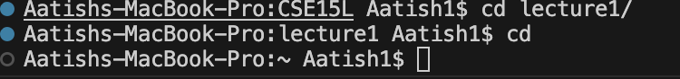
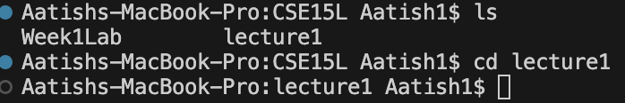
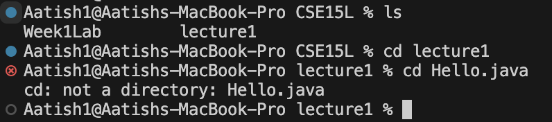
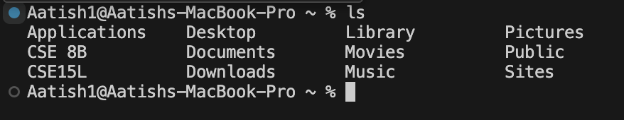
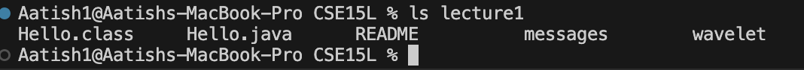
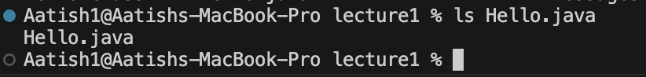
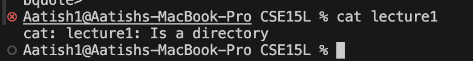
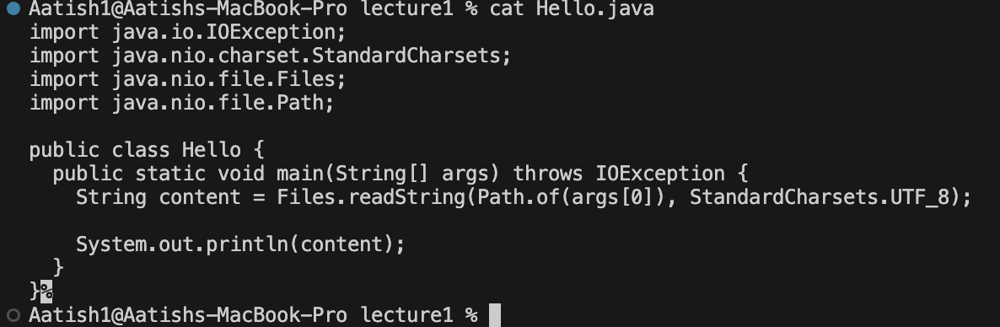

# Lab Report 1
## Aatish Mandalapu - A17350430
---

### 1. `cd` command
- #### Share an example of using the command with no arguments.
- 
- Absolute Path = `/Users/Aatish1/CSE15L/lecture1`
- Output is not an error
- If `cd` command is executed without any arguments it will place you in the home directory
---
- #### Share an example of using the command with a path to a directory as an argument.
- 
- Absolute Path = `/Users/Aatish1/CSE15L/`
- Output is not an error
- The `cd lecture1` command allows terminal to change from the current working directory to `lecture1`.
---
- #### Share an example of using the command with a path to a file as an argument.
- 
- Absolute Path = `/Users/Aatish1/CSE15L/lecture1`
Output is an error because you cannot change the working directory to a file. The `cd` command is only compatible with directories.
- Explanation: The `cd` command can only change directories, and since we used `Hello.java`, which is a file, we got an error saying that `Hello.java` is not a directory.  
---

### 2. `ls` Command
- #### Command Share an example of using the command with no arguments.
- 
- Absolute Path = `/Users/Aatish1`
- Explanation: The `ls` command lets terminal provide a complete list of files and directories in the working directory. If ran without any arguments, `ls` will display the files/directories in the current directory.
---
- #### Share an example of using the command with a path to a directory as an argument.
- 
- Absolute Path = `/Users/Aatish1/CSE15L`
- Explanation: The `ls lecture1` command provides a list of all files and directories in the `lecture1` directory. This worked because `lecture1` directory is in the current working directory.
---
- #### Share an example of using the command with a path to a file as an argument.
- 
- Absolute Path = `/Users/Aatish1/CSE15L/lecture1`
- Explanation: The `ls lecture` command will attempt to list all the files and directories located in the file. However, since `Hello.java` is a file located in the current working directory, it will only print the name, `Hello.java`, into the terminal.
---
### 3. `cat` Command
- #### Share an example of using the command with no arguments.
- 
- Absolute path = `/Users/Aatish1/CSE15L/lecture1`
- The `cat` command without any arguments after will present a blank input and will whatever is inputted will be echoed back until you end the input by using `Ctrl C`. 
---
- #### Share an example of using the command with a path to a directory as an argument.
- 
- Absolute Path = `/Users/Aatish1/CSE15L`
- Output is an error because `lecture1` is a directory, and the `cat` command cannot print entire directories.
Explanation: The `cat` command only displays the content of a file not a directory. Since `lecture1` is a directory, running `cat` on it will produce an error.
---
- #### Share an example of using the command with a path to a file as an argument.
- 
- Absolute Path = `/Users/Aatish1/CSE15L/lecture1`
- Explanation: The `cat Hello.java` command worked because the file, `Hello.java` is located within the `lecture1` directory. Therefore, terminal was able to print the content within `Hello.java`.
---